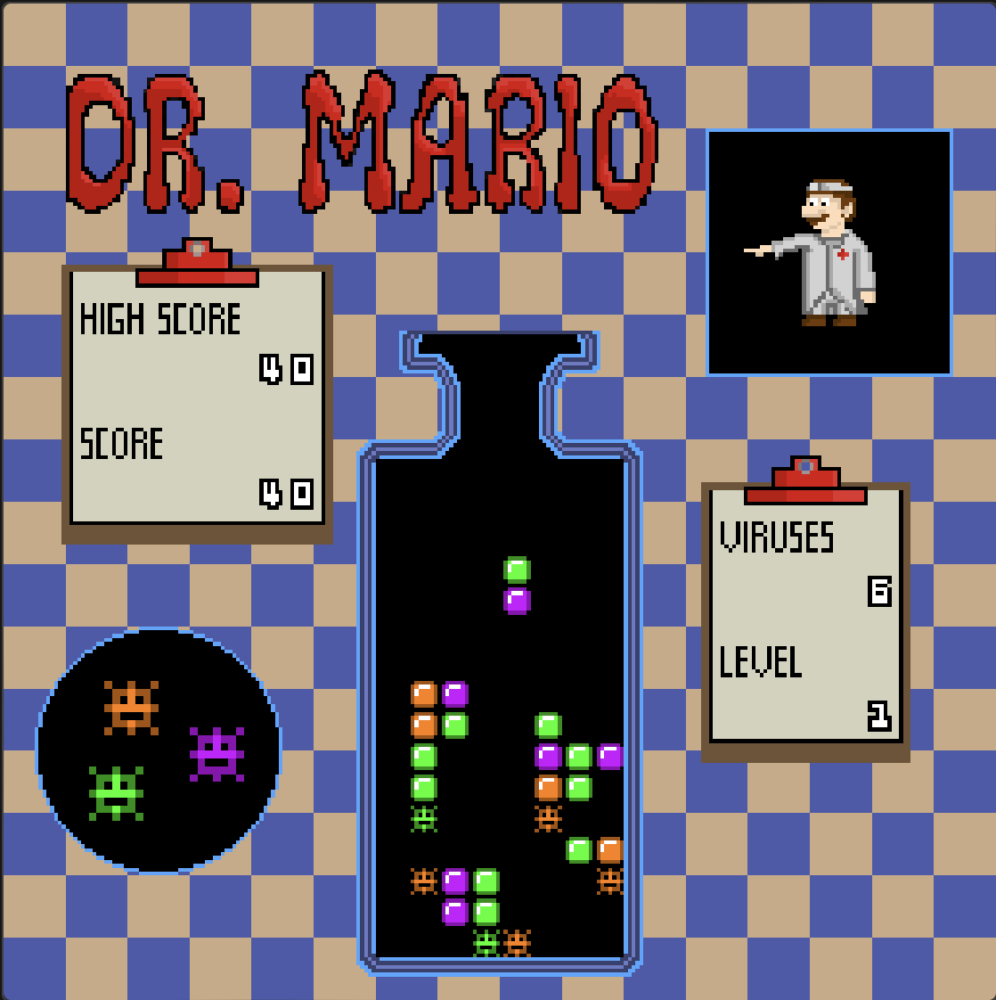
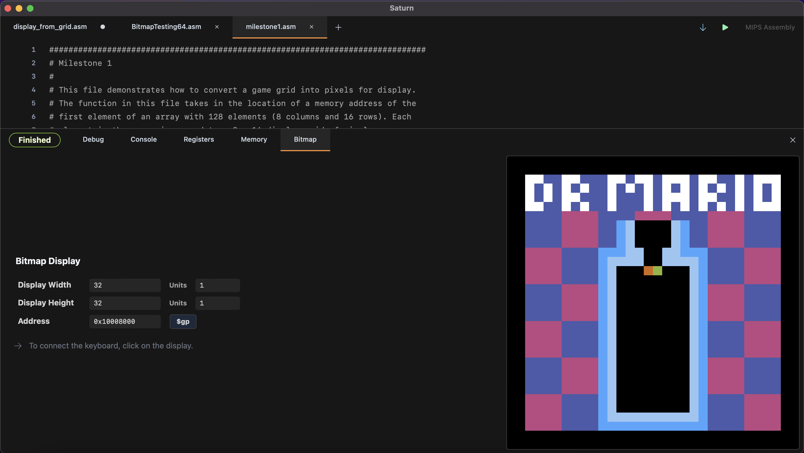
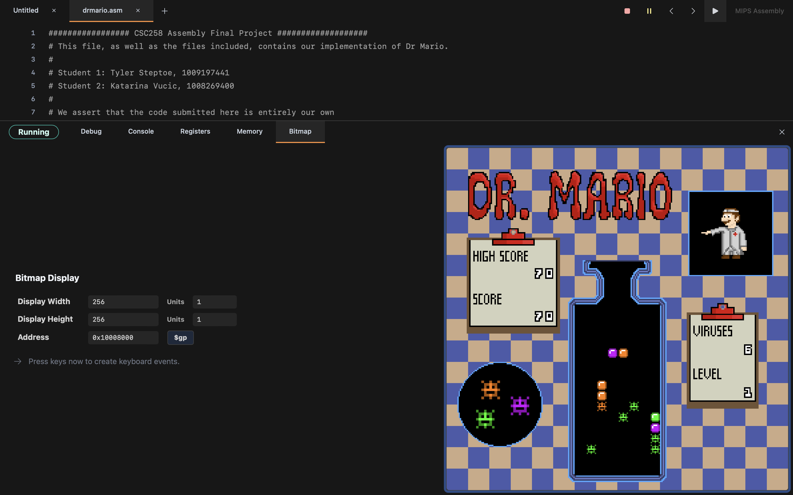
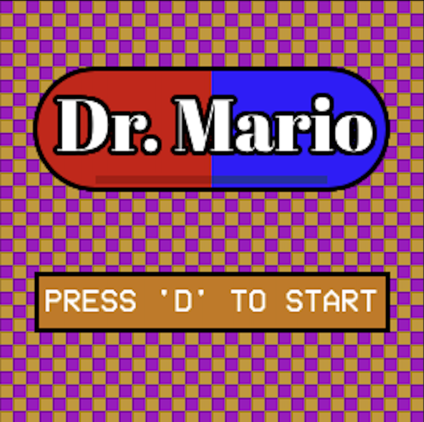
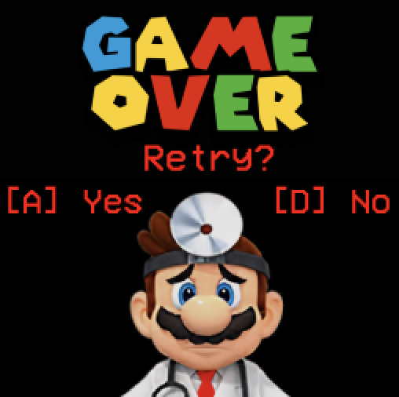
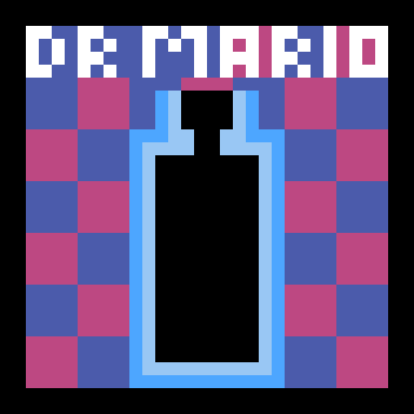
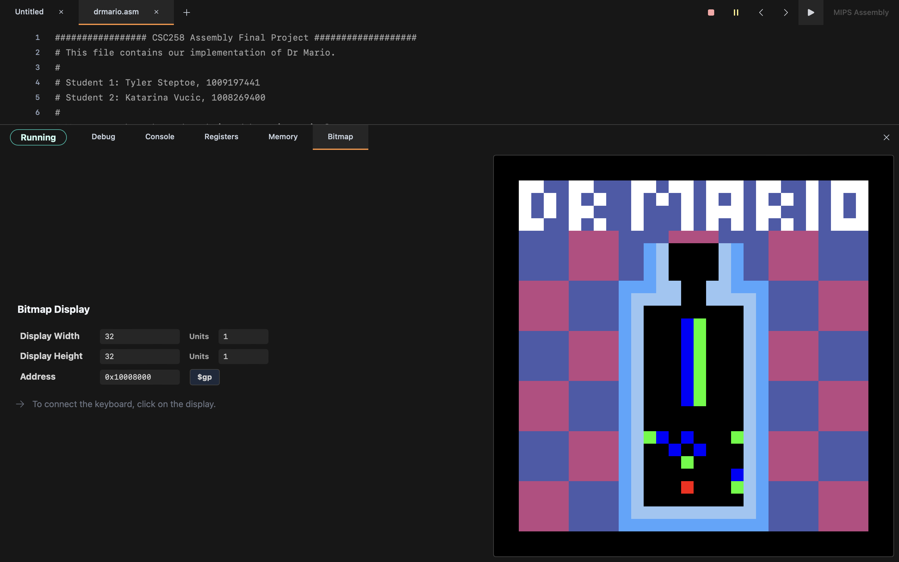

# Instruction and Summary

<figure id="Dr Mario Final Design">

<figcaption>The final design of the game.</figcaption>
</figure>

1.  Which milestones were implemented?

    -   Milestones 1, 2, 3, 4, and 5 were implemented.

        <figure id="Milestone 1">
        
        <figcaption>Milestone 1: Dr Mario game screen with randomly generated
        capsule.</figcaption>
        </figure>

        <figure id="Milestone 5">
        
        <figcaption>Milestone 5: The game by the end of our
        implementation.</figcaption>
        </figure>

    -   Easy Features Implemented:

        -   1\. Implement Gravity

        -   4\. Game Over Screen and Retry

        -   5\. Sound Effects

        -   6\. Pause Screen

        -   7\. Levels with Increasing Difficulty

        -   10\. Track and Display High Score

        -   13\. Draw Mario and Viruses

        -   Extra: Level Number Displayed

        -   Extra: Number of Viruses Left Displayed

        -   Extra: Main Menu Screen Implemented

    -   Hard Features Implemented:

        -   1\. Track and Display Score on Display

        -   5\. Play Dr. Mario’s Theme Music

        -   Extra: Implementing .bmp renderer for 256p x 256p Display

        -   Extra: Implementing Sprite Sheet and Renderer

2.  How to view the game: Bitmap Display Configuration:

    -   Unit width in pixels: 1

    -   Unit height in pixels: 1

    -   Display width in pixels: 256

    -   Display height in pixels: 256

    -   Base Address for Display: 0x10008000 ($gp)

    -   To Run: Extract drmariogame.zip. Ensure all .bmp and .asm files
        are in the same directory. Drag ’drmario.asm’ into Saturn, and
        click play. IMPORTANT: Make sure you are using Saturn v0.1.10 or
        else it will not load properly.

    -   Warning: game may lag at first due to the downloading of MIDI
        instruments, but should clear up.

    -   Controls: \[A\] = Move Left, \[D\] = Move Right, \[S\] = Move
        Down, \[W\] = Rotate, \[Q\] = Quit, \[P\] = Pause

    <figure id="fig:test">
    <figure id="fig:sub1">
    
    <figcaption>Main Menu Screen</figcaption>
    </figure>
    <figure id="fig:sub2">
    
    <figcaption>Game Screen</figcaption>
    </figure>
    <figure id="fig:sub3">
    
    <figcaption>Game Over Screen</figcaption>
    </figure>
    <figcaption>Dr. Mario Final Design</figcaption>
    </figure>

    <figure id="Dr Mario Initial Game Design">
    
    <figcaption>Dr Mario Game Initial Design, pre-milestone 2</figcaption>
    </figure>

3.  Game Summary:

    -   Our game consists of various .asm files and .bmp files. Saturn
        allowed us to encapsulate our code to make it easier to read and
        maintain.

    -   Each capsule is drawn initially as a 16p x 8p object at the neck
        of the bottle. The colour for each half is chosen randomly. If
        the bottle is blocked during an attempt to spawn a capsule, the
        game is over. Gravity and collisions work as intended. Lines of
        4 or more get cleared once the capsule lands, and any
        unsupported pieces of capsule gets dropped to the bottom.
        Viruses look distinct from capsules, and are not affected by
        gravity.

    -   The complex background, sprites, and overall high resolution was
        achieved by reading .bmp file data from pixel art images we
        created. This allowed us to draw all backgrounds and sprites in
        a separate image editor and load them into the game.

    -   Various screens exist in the game, including the main menu, the
        game screen, a pause screen, and a game over screen. These are
        each loaded in as different .bmp files.

    -   In the game screen, various stats are displayed such as your
        current score, your high score (which is maintained when
        retrying from game over), the number of viruses left on screen,
        and the current level.

# Attribution Table

| **Student 1 (Tyler Steptoe / 1009197441)** | **Student 2 (Katarina Vucic / 1008269400)** |
|:--:|:--:|
| Milestone 1 | Milestone 1 |
| Milestone 2 | Milestone 2 |
| Levels (Easy 7) | Designed game background |
| Created BMP file loader/renderer | Mapped game grid to pixels |
| Random capsule generation | Integrated image upload with game grid display ( Milestone 1) |
| Random Virus Generation | Base code to respond to keyboard controls |
| Gravity (Easy 1) | Added sound effects for rotating, dropping, win, lose (Easy 5). |
| Capsule Movement | Implemented theme song for game (Hard 5). |
| Created and implemented sprite sheet logic | Designed 256x256 game grid. |
| Collision and line detection (Milestone 3) | Drew Mario and Viruses (Easy 13). |
| Displayed score and high score (Hard 1/Easy 10) | Drew Clipboards for high score and score (Easy 10). |
| Game Over and Pause Screen (Easy 4 and 6) |  |

Credit to https://www.textstudio.com/ for the Super Mario font.

# Progress

**Deliverable 1:**

Milestone 1 was implemented relatively easily after creating the
renderer for .bmp files.

Our progress on Milestones 2 and 3 was delayed due to our attempt to use
a bigger grid (256x256) to have a more detailed grid and display. We
have made progress on converting our game grid to have each capsule be
8x8 pixels instead of 1x1.

Milestone 2 is almost complete, we have the keyboard responding to input
but have not been able to get it working with our game grid calculation
without bugs yet. Additionally, we have been successful in doing the
gravity calculations but have had issues integrating it into calculating
the next game grid.

**Deliverable 2:**

Milestone 2 was completed shortly after the first demonstration. We
decided a sleep time of 17ms between each frame was sufficient.
Collision was determined by checking the spaces around the controlled
capsule after each key press. A similar method was implemented for
gravity.

Milestone 3 took by far the longest to complete. This is due to the
complexity of the line checking algorithm and the amount of steps it
needs to complete in order to find a row, make sure they’re all the same
colour between viruses and capsules, clear that line and only that line,
have it work for groups of 4 or more than 4, and drop all the
unsupported capsules after it. We ended up making a large flow chart
with the logic before we implemented it in assembly, and even then the
implementation and bug fixing took a lot of time after.

Milestones 4 and 5 were completed relatively easily. We had decided
prior which features each of us wanted to work on, and worked on them
until it was time to merge all the changes. Creating the bmp file
renderer and sprite loader earlier made a lot of these steps very
straightforward.

Overall, we are very happy with the amount of work we put in to this
project, and are proud of the result. We hope that comes through during
playtesting.

<figure id="readme_images/Dr Mario Game Design">

<figcaption>Milestone 2 progress.</figcaption>
</figure>

# More Details

Here, we will go into more technical details about the project.

The project is split up into 9 `.asm` files:

-   `drmario.asm` (The main file)

-   `game_grid.asm`

-   `capsules.asm`

-   `keyboard.asm`

-   `capsule_control.asm`

-   `game_renderer3.asm`

-   `viruses.asm`

-   `line_check_algorithm.asm`

-   `sound_effects.asm`

... and 5 `.bmp` files:

-   `drmario256.bmp`

-   `gameover.bmp`

-   `paused.bmp`

-   `mainmenu1.bmp`

-   `drmariosprites.bmp`

The following section summarizes what each `.asm` file does:

1.  `drmario.asm`

    The main file, and the one to click ’run’ on in Saturn. This file
    links all of the other files, and contains most of the labels and
    memory reservations. It also contains the game loop, and calls
    functions to load each background. If files need to communicate to
    each other, it is done through this main file first. This file
    contains the game loop, the pause loop, the main menu loop, and the
    game over loop. It is also where the program sleeps for the
    specified amount of time, and where the frame counter lives.

2.  `game_grid.asm`

    This file initializes and calculates the grid ’object’ that stores
    the state of the game. It is essentially an 8 x 16 array that stores
    the state of every cell on the game grid, i.e. if it’s empty, what
    colour/type of capsule occupies it, or what virus is in it. Each
    element of the array is simply an integer representing the object in
    that cell. There are also functions for checking if the bottle is
    blocked, and to print the state of the grid to the console for
    debugging. This is also where the gravity affects the capsules, set
    to once every 20 frames.

3.  `capsules.asm`

    This file essentially initializes the capsule ’objects’. Each
    capsule is stored in a portion of memory 8 bytes long, and each byte
    contains an integer that represents some type of data about the
    capsule. For example, byte 0 and 1 always represent the colours of
    the halves of the capsules.

4.  `keyboard.asm`

    This file updates the `key_pressed` label with a number
    corresponding to what letter was pressed on the keyboard for other
    functions to read and use accordingly. When the rotate button (W) is
    pressed, it will play a swish sound effect, and when the drop
    button (S) is pressed, it will play a drop sound effect.

5.  `capsule_control.asm`

    This file is what moves the controlled capsule when a keyboard input
    is detected. This is where the collision detection takes place.
    There is a lot of logic checking the relative elements of the cells
    of the grid where the capsule wants to move into based on the
    current state. It only allows movement/rotation if the element is
    not blocked.

6.  `game_renderer_3.asm`

    One of our most technically impressive files. This is where the
    bitmap file data is read and then stored into memory. The
    `load_background` function takes the filename of a `.bmp` file and
    loads the pixels into a buffer and then into the display address.
    This is how we are able to make complex backgrounds. This woudln’t
    have been possible for us if it weren’t from knowledge from CSC209.

    This file also takes a sprite sheet and loads all the sprites into
    memory. The sprite sheet is 256p x 256p total, with each sprite
    being 8p x 8p aligned in a grid. Then, it is able to take the state
    of the grid from `game_grid.asm` and draw the relevant sprite for
    each cell using a bit of math and loops for the offset and the x and
    y index of the requested sprite in the sprite sheet. This is also
    where the game stats like score are rendered; using sprites as well
    for each number.

    We hope that this implementation is enough to earn at least one
    extra hard feature.

    The reason it’s game_renderer #3 is because the first two were
    testing with 32p x 32p and 64p x 64p displays respectively.

    The numbers for the various statistics are displayed to the screen
    through some math and `beq` statements. The total score is divided
    by 10 and the quotient is stored back into the total score. The
    remainder of that is then what gets displayed, based on 10 branching
    instruction based on what digit it is from 0-9. Then it calls itself
    again on the quotient of the previous calculation.

7.  `viruses.asm`

    Similar to `capsules.asm`, this file is used to generate the data
    for the virus objects.

8.  `line_check_algorithm.asm`

    This file took the most time to complete out of any. It contains the
    logic for checking and clearing any lines of 4 or more in a row,
    called one time every time a capsule lands, and then if a line was
    cleared, it calls itself again in 3 seconds to account for any
    falling halves of capsules.

    For optimization purposes, this first goes through all the rows to
    detect if there are at least 4 non-zero elements. If there is, it
    will then loop through all 3 colours and determine if there are 4 or
    more in a row. If it does detect a valid line, it will clear each
    cell, adjust the virus and capsule numbers accordingly, and update
    the score. Then it will do the same for the columns.

    When the four-in-a-row condition is met, it will play a burst sound
    effect.

    Keeping track of what registers were used where and loop edge cases
    were what took the most time when developing this algorithm.
    Planning this out on paper was essential before writing this in
    assembly code.

9.  `sound_effects.asm`

    This file contains functions to add the theme song, win sound
    effect, and lose sound effect to the game.

    The theme song played is the fever - mario paint player s guide
    version. The MIDI file was retrieved from
    <https://www.khinsider.com/midi/nes/dr.-mario> and parsed into
    instruments, pitches, and durations that were mapped to assembly
    array code initialization. There are 10 instruments, each with its
    own pitches and durations arrays. Each array is 442 words
    representing each note start time in the theme song. If an
    instrument should not be played at that start time, it is given a
    pitch and duration of 0. These arrays take up about 900 rows in this
    file. To play the theme song, `drmario.asm` calls the
    `sound_theme_song` function, which retrieves the theme_counter
    stored in memory and plays all 10 instruments with the pitch and
    duration located at the theme_counter spot in memory. If the
    theme_counter is equal to the pitch_count (442), then the
    theme_counter is set to 0. The theme_counter is stored back into
    memory and the function returns back to `drmario.asm`.

    The win and lose sound effects are called in `drmario.asm` win the
    win or lose condition is met, respectively. They play a short jingle
    that took a lot of trial and error and playing around with different
    notes to perfect. The key difference between the sound effects and
    the theme song is that the sound effects required a short sleep in
    between to play the notes consecutively. Sound effects for rotate
    and drop are included in `keyboard.asm` and four-in-a-row were
    implemented in `line_check_algorithm.asm` and were implemented
    similarly.
